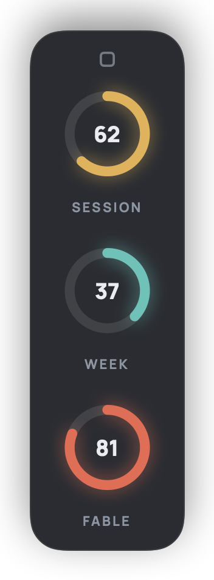
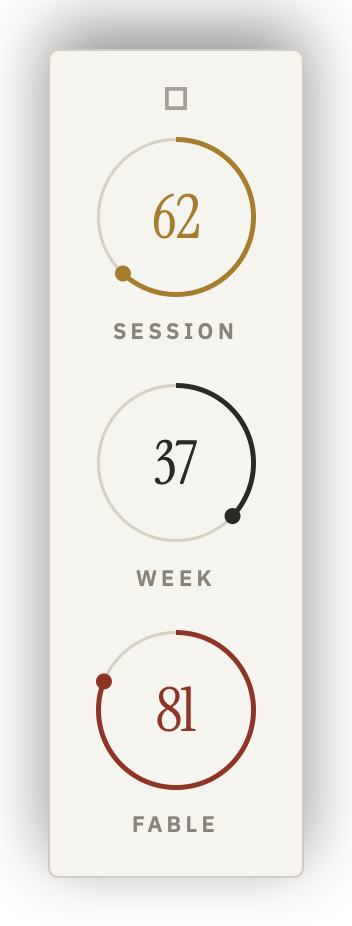
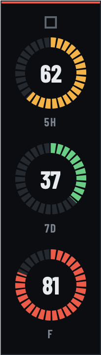
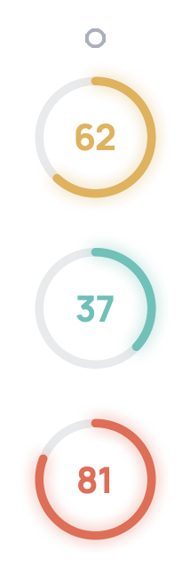
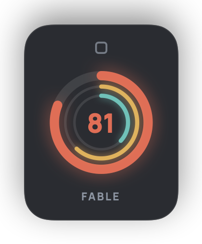
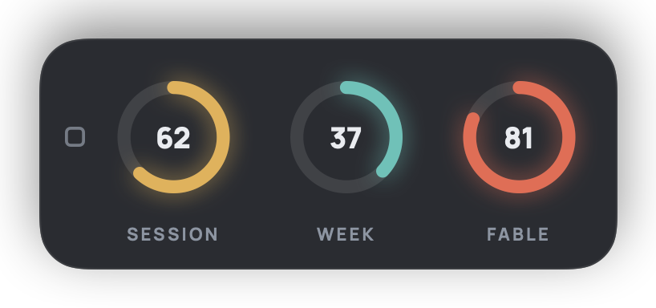

# Annular themes

Themes for [Annular](https://annular.app), the Mac app that shows your AI usage limits as rings in the menu bar and in a corner of your screen.

A theme is one small JSON file with the ending `.annulartheme`.
It sets the colors, the fonts, the panel, the rings, the labels, and the layout.
This repo holds the six themes that ship with Annular, themes made by other people, and the description of the format.

## The built-in themes

<table>
  <tr>
    <td align="center" width="33%"><br><br><b><a href="themes/built-in/annular.annulartheme">Annular</a></b><br>The default: glowing arcs on a translucent panel.</td>
    <td align="center" width="33%"><br><br><b><a href="themes/built-in/editorial.annulartheme">Editorial</a></b><br>Paper, hairline rings, serif numerals.</td>
    <td align="center" width="33%"><br><br><b><a href="themes/built-in/signal.annulartheme">Signal</a></b><br>A segmented gauge in green, amber, and red.</td>
  </tr>
  <tr>
    <td align="center" width="33%"><br><br><b><a href="themes/built-in/minimal.annulartheme">Minimal</a></b><br>No panel. Just the rings on your desktop.</td>
    <td align="center" width="33%"><br><br><b><a href="themes/built-in/dial.annulartheme">Dial</a></b><br>One ring for the tightest limit, the others inside it.</td>
    <td align="center" width="33%"><br><br><b><a href="themes/built-in/strip.annulartheme">Strip</a></b><br>Three rings in a row along an edge.</td>
  </tr>
</table>

These six are already in the app.
They are here so you can read them, and start your own from one.

## Community themes

None yet. Yours could be the first: see [Share a theme](#share-a-theme).

## Use a theme

1. Download the `.annulartheme` file.
2. Double-click it. Annular adds the theme and switches to it.

You can also open Annular's Settings, go to Appearance, and click Import.

A theme is only data: colors, names of fonts, numbers, and a few words.
It cannot run anything, and Annular reads nothing else from the file.
If a theme names a font your Mac does not have, Annular uses the theme's fallback fonts, then the system font.

## Make a theme

The easy way is inside the app:

1. Open Settings, then Appearance.
2. Pick the theme that is closest to what you want, and click Duplicate.
3. Change colors, fonts, the panel, and the rings. The rings on your screen follow every change.
4. Click Export to save it as a `.annulartheme` file.

The other way is a text editor.
[FORMAT.md](FORMAT.md) lists every key, what it does, and the values it takes.
Every key is optional except `id`, so a theme can be as short as this:

```json
{
  "schemaVersion": 4,
  "id": "com.example.night-shift",
  "name": "Night Shift",
  "author": "Your name",
  "palette": { "normal": "#7aa2f7", "accent": "#7aa2f7" },
  "ring": { "cap": "butt", "glow": false }
}
```

## Share a theme

Open a pull request that adds two files:

- `themes/community/your-theme.annulartheme`
- `img/community/your-theme.png`, a picture of the corner rings in your theme

[CONTRIBUTING.md](CONTRIBUTING.md) has the few rules, and a check runs on every pull request: `node tools/validate.mjs`.

## License

The themes, their pictures, and the check in this repo are under the [MIT License](LICENSE).
The Annular app is not part of this repo and is not open source.

## Questions

This repo is only about themes.
For help with the app, see [annular.app/help](https://annular.app/help) or write to support@annular.app.

Annular is an independent tool and is not affiliated with, endorsed by, or sponsored by Anthropic or OpenAI.
